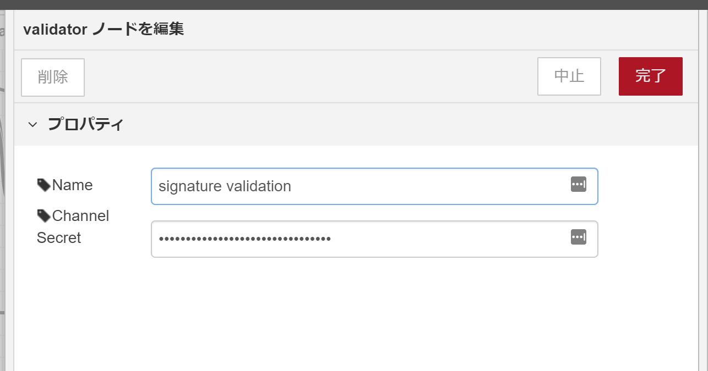
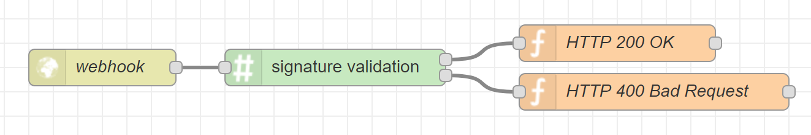

# node-red-contrib-line-signature-validator

This node is to verify signature of incoming message of LINE messaging API.

## Usage
### Configuration
Before using this node, `Channel Secret` has to be set, it's in LINE Developers console.

### Connection
The input is incoming message.

And there are two output connections.  the message outputs to upper one if the message is valid, and lower one if it's invalid. 

